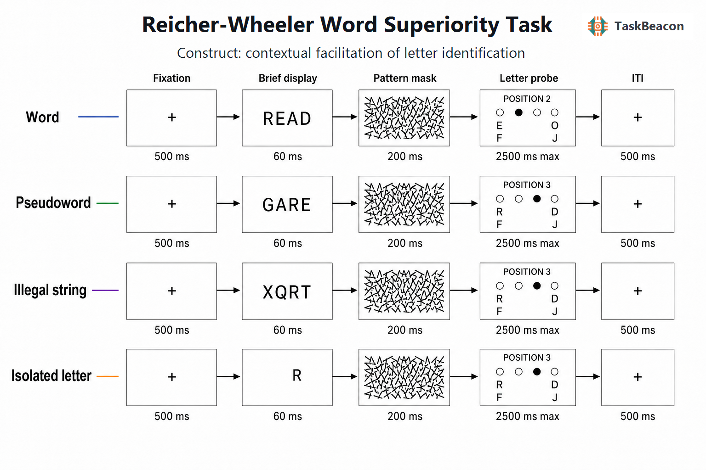

# 词优势效应的实验逻辑、认知机制与 Reicher–Wheeler 范式

视觉词识别研究的基本问题之一，是熟悉的正字法上下文能否改变组成字母的知觉质量。若词仅因可猜测、易记忆或便于命名而优于无意义字符串，任务差异主要发生在知觉后的决策阶段；若在严格控制反应备选后，词中的同一字母仍更易辨认，则词汇与亚词汇知识可能已经参与字母表征的形成。词优势效应（word superiority effect, WSE）正是围绕这一可识别性问题建立的：在短暂呈现和掩蔽条件下，词内字母的辨认准确率通常高于孤立字母或非法字符串中的同一字母。Reicher–Wheeler 范式以呈现后的二选一字母判断限制非知觉猜测，使这一群体效应成为检验视觉特征、字母位置、正字法规则与词汇表征如何交互的重要方法（Reicher, 1969; Wheeler, 1970; Jordan et al., 2024）。

## 1. 范式提出与理论背景

早期短时呈现研究已发现词比等长无意义材料更容易报告，但整词报告允许参与者利用词汇知识补全未被看清的字母。Reicher（1969）在刺激消失并被掩蔽后提供两个字母备选，将报告目标限定为一个位置上的字母。Wheeler（1970）进一步平衡目标位置、词频和刺激—探测间隔，并以阈限程序使表现离开天花板；其结果显示，四字母词中的目标字母比单独呈现时平均约高 10 个百分点。该程序由此被称为 Reicher–Wheeler 范式。

范式的关键控制在于两个备选与剩余上下文同等相容。例如，呈现 READ 后探测首位字母时，R 与 H 分别构成 READ 与 HEAD；词汇知识不能仅凭“哪个备选能组成词”决定答案。非法字符串和孤立字母条件应沿用相同目标—备选配对。严格匹配后，`词 > 非词` 或 `词 > 孤立字母` 的准确率差异才可主要归于上下文对刺激加工的影响；自由报告、词—非词判断或只有一个备选能组成词的程序不能提供同等控制（Jordan et al., 2024）。

词优势效应并不等于整词轮廓完全取代逐字母加工。Baron 和 Thurston（1973）发现，可发音伪词相对于非法字符串也能促进字母辨认，说明语义和整词熟悉度不是充分解释；McClelland（1976）进一步分离词、伪词和无关字符串，并发现大小写一致性与正字法熟悉度均影响表现。交互激活模型据此提出视觉特征、位置特定的字母单元和词单元之间存在兴奋与抑制，部分激活的词单元可反向强化相容字母；多个近邻的部分激活也可产生伪词优势（McClelland & Rumelhart, 1981）。这一模型能够组织核心现象，但范式数据本身不能在神经层面证明反馈连接，也不能排除学习得到的前馈统计表征或知觉后证据整合。

## 2. 任务逻辑、流程与核心参数

典型试次先呈现中央注视，随后短暂呈现四至五个字母组成的词、可发音伪词、非法字符串或一个位于相同空间位置的孤立字母。刺激立即被高对比度图案掩蔽；掩蔽后才标示待测位置并呈现两个字母备选。参与者选择实际出现的字母，即使不确定也须猜测。探测位置后置可降低预先将空间注意集中于单一位置的可能，图案掩蔽则中断可见持续和图像记忆中的进一步读取（Johnston & McClelland, 1973）。

经典研究常为每名参与者调整呈现时长，使总体准确率处于约 70%–80% 的敏感区间；固定时长版本则需在正式分析前检查地板、天花板及条件间速度—准确率权衡。主要因变量是各上下文的二选一准确率，反应时可作为补充。核心对比包括 `词 − 非法字符串`、`词 − 孤立字母` 及 `伪词 − 非法字符串`；目标位置应作为平衡因素或模型中的固定效应，而不能在各条件间混杂。混合效应逻辑回归比先按参与者求百分比更能同时处理参与者与项目差异。若采用阈限或自适应程序，达到同等准确率所需的呈现时长也可作为指标，但它与固定时长下的准确率差值不是同一测量尺度。

任务的阶段解释需要保持分离。短暂刺激和掩蔽主要限制视觉特征编码、字母位置编码及正字法上下文的可用时间；后置位置线索与二选一反应测量对目标字母证据的读取和决策。反应时还包含备选映射与运动执行，因此不能单独视为词汇激活速度。无反馈设计可避免逐试次强化特定字母配对，但项目重复、备选侧别和练习仍可能改变策略，宜在区组间反转左右映射并平衡每个刺激成员。

## 3. 主要行为与神经科学发现

### 3.1 正字法上下文、空间位置与视觉限制

行为证据较一致地支持词对非法字符串和孤立字母的群体水平优势，但效应量依赖掩蔽、刺激持续时间与基线。Johnston 和 McClelland（1973）发现，高对比度随机轮廓掩蔽产生稳定词优势，而白色前后场可使效应消失，表明 WSE 不是脱离观看条件的恒定属性。伪词优势则提示熟悉字母组合和正字法邻域也能提供促进；它的大小同时受可发音性、邻域结构和项目匹配影响（Baron & Thurston, 1973; McClelland, 1976）。

字母位置效应还受到中央凹视敏度和视觉拥挤影响。中央注视时，首尾字母邻接成分较少，中间位置虽视敏度较高却更易受到两侧字母干扰；因此位置函数不能直接解释为词汇反馈强弱。中央与外周视野的研究显示，词优势可在外周减弱或反转，说明空间位置和拥挤会限制词汇分析（Sand et al., 2016）。近期通过操纵字母间距并保持目标—备选词对匹配的研究发现，非词内字母在紧密间距下受明显拥挤，而词内字母准确率相对稳定；这支持词层信息可帮助恢复受损字母证据，但“整体识别”仍是对结果的模型解释而非任务直接观测量（Cutler et al., 2024）。

跨文字系统研究表明，WSE 不能简单视为语言无关常数。阿拉伯语—英语双语者在两种文字中均表现出上下文效应，且阿拉伯语的形态—韵律结构改变了伪词与位置效应（Marzouki et al., 2022）。不过该研究使用位置提示后的字母报告而未实施两个同等合理备选，严格说不能排除词汇猜测，因而更适合作为上下文效应证据而非标准 Reicher–Wheeler 效应的复现（Jordan et al., 2024）。采用系统析因技术的中英文比较则发现，英语词和伪词的加工效率优于非词，而汉字整体相对部件未呈现相同优势，提示刺激单位和任务指标的定义会改变跨文字结论（Zhang et al., 2023）。

### 3.2 EEG 与 fMRI 证据

事件相关电位（event-related potential, ERP）研究为上下文作用的时间进程提供了任务相关证据。Martin 等（2006）在掩蔽的 Reicher–Wheeler 任务中发现，词与非法非词约在刺激后 200 ms 的 N1 时窗已出现差异，并随暴露时长变化，支持视觉词形信息可在较早阶段约束字母识别。Coch 和 Mitra（2010）同时观察到词与伪词优势，其条件差异涉及 P150、N200、N300 和 N400，显示上下文影响从早期视觉—正字法加工延续至较晚的词汇/决策阶段。早期头皮成分不能精确定位信息来源，晚期差异也可能包含掩蔽、备选评价和反应准备，故 ERP 结果不支持把效应归于单一阶段。

功能磁共振成像（functional magnetic resonance imaging, fMRI）的直接 Reicher–Wheeler 证据较少。Heilbron 等（2020）采用含噪词/非词序列和多变量模式分析，发现词上下文提高了早期视觉皮层中目标字母的可解码性，并增强该信息与左侧视觉词形区、后中颞回及额下回活动的耦合。结果与高层语言网络增强低层字母表征的解释一致，但该任务不是经典的掩蔽后二选一程序，且 BOLD 信号无法确定反馈发生的精确时点。因此，fMRI 证据属于对知觉增强解释的会聚支持，不能替代范式内的行为控制或建立因果方向。

## 4. 范式发展与主要应用

该范式的重要发展，是由“词是否优于字母”扩展到正字法学习、阅读发展与受损阅读系统的比较。Grainger 等（2003）在发展性阅读障碍儿童、阅读年龄匹配儿童和实际年龄匹配儿童中使用词、伪词与非法非词条件；三组呈现质性相似的词和伪词优势，而阅读障碍组在其他词汇判断和朗读指标上受损。这说明群体阅读困难不必然意味着上下文促进缺失，也警示不能把单一 WSE 差值当作诊断标志。纯失读个案仍可表现词优势，同样表明正常的上下文差异与流畅整词阅读之间并非一一对应（Starrfelt et al., 2013a）。

心理物理建模把准确率进一步分解为知觉阈限和加工速度。Starrfelt、Petersen 与 Vangkilde（2013b）发现中央视野的词优势可体现为更快加工，而不同暴露时长下的阈限并非始终不同。这类结果说明同一个准确率差值可能由感觉阈限、加工速率或有限呈现后的证据累积产生。跨语言、发展和临床应用因而应匹配词频、正字法邻域、字母形状、长度、目标位置及阅读熟练度，并报告项目层变异，而不宜仅比较条件均值。

## 5. 测量效度与解释边界

Reicher–Wheeler 范式的主要构念效度来自目标字母和备选在不同上下文中的严格匹配。若只有正确备选形成真实词、探测前已提示位置、刺激类别要求不同反应，或把整词报告称为 WSE，词汇猜测、空间注意和任务集合将与知觉促进混杂（Jordan et al., 2024）。图案掩蔽、视角大小、字母间距和呈现阈限也会改变效应；固定时长在异质样本中尤其容易使部分参与者接近随机猜测、另一些接近满分。研究设计宜先以独立练习或阶梯程序校准暴露时长，并对准确率、遗漏和反应时共同建模。

WSE 在群体均值上可重复，不等于差值分数适合个体排序。该范式缺少充分的重测信度与常模证据；条件差由两个含误差的均值相减，短任务中的项目抽样误差可能较大。临床或相关研究应预注册目标对比、增加每条件试次数、采用层级模型并另行评估重测信度。词优势还同时反映视觉质量、正字法合法性、词汇邻域、阅读经验和决策约束，不能据单一对比推断特定脑区的反馈、阅读能力优劣或疾病机制。ERP 与 fMRI 结果可限定时间和空间假说，但现有研究尚不足以支持因果解释。

## 6. TaskBeacon 中的任务实现

### 6.1 任务资源与访问入口

| 资源 | ID | 用途 | 地址 |
|---|---|---|---|
| 完整实验源码 | T000104 | PsychoPy/PsyFlow 英文行为任务 | [GitHub](https://github.com/TaskBeacon/T000104-word-superiority-effect-task) |
| 浏览器配对源码 | H000104 | 与完整任务对齐的浏览器行为预览 | [GitHub](https://github.com/TaskBeacon/H000104-word-superiority-effect-task) |
| 在线运行入口 | H000104 | 无需本地安装的任务体验 | [TaskBeacon Web Runner](https://taskbeacon.github.io/psyflow-web/?task=H000104-word-superiority-effect-task) |

H000104 对条件、项目矩阵、试次数、时序、反应语义和计分作等值移植，但浏览器原生文本与图形渲染及设备刷新率不等同于受控 PsychoPy 环境。它适合流程预览和一般行为采集，不应替代需要精确视觉时序的实验验证。

### 6.2 实现流程与关键参数

TaskBeacon 当前版本采用 2 个区组、每区组 32 试次，共 64 试次。每一区组完整交叉四类上下文（英语词、可发音伪词、非法字符串、孤立字母）、四个目标位置及配对刺激的 A/B 成员。试次随机呈现；第二个区组为各位置启用另一组项目矩阵，并反转左右备选。主要输出包括上下文、目标位置、项目与配对标识、目标和备选字母、正确键、反应、反应时、正确性及遗漏状态。

**图 1. TaskBeacon 当前实现的试次流程。** 每个试次依次为中央注视 500 ms、四槽位刺激 60 ms、由 72 个不规则线段构成的高对比图案掩蔽 200 ms、位置标记与两个字母备选（最长 2500 ms）以及注视形式的试次间隔 500 ms。四类条件分别在相同槽位呈现四字母英语词、可发音伪词、非法字符串或仅呈现目标字母；掩蔽后才显示待测位置。参与者按 F 选择左侧字母、按 J 选择右侧字母，超时记为遗漏，正确性由所选键与目标字母所在侧比较。任务不呈现逐试次反馈，也不设置积分或奖励。当前版本无自适应控制器，所有参与者均使用固定 60 ms 暴露时长；因此正式研究需另行确认该时长能否使目标样本保持在敏感准确率区间。

该实现保留了 Reicher–Wheeler 控制的核心：同一对字母在配对词中均形成合法词，在伪词和非法字符串中也保持相同类别，孤立字母占据对应空间位置。固定呈现时长提高了跨设备部署的一致性，却不同于经典研究的个体阈限校准；分析时应优先报告各上下文准确率及其置信区间，并检验位置和项目效应。现有仓库文件无法确认固定 60 ms 已在特定目标人群中完成心理物理标定。

## 参考文献

Baron, J., & Thurston, I. (1973). An analysis of the word-superiority effect. *Cognitive Psychology, 4*(2), 207–228. https://doi.org/10.1016/0010-0285(73)90012-1

Coch, D., & Mitra, P. (2010). Word and pseudoword superiority effects reflected in the ERP waveform. *Brain Research, 1329*, 159–174. https://doi.org/10.1016/j.brainres.2010.02.084

Cutler, J., Bodet, A., Rivest, J., & Cavanagh, P. (2024). The word superiority effect overcomes crowding. *Vision Research, 222*, Article 108436. https://doi.org/10.1016/j.visres.2024.108436

Grainger, J., Bouttevin, S., Truc, C., Bastien, M., & Ziegler, J. (2003). Word superiority, pseudoword superiority, and learning to read: A comparison of dyslexic and normal readers. *Brain and Language, 87*(3), 432–440. https://doi.org/10.1016/S0093-934X(03)00145-7

Heilbron, M., Richter, D., Ekman, M., Hagoort, P., & de Lange, F. P. (2020). Word contexts enhance the neural representation of individual letters in early visual cortex. *Nature Communications, 11*, Article 321. https://doi.org/10.1038/s41467-019-13996-4

Johnston, J. C., & McClelland, J. L. (1973). Visual factors in word perception. *Perception & Psychophysics, 14*(2), 365–370. https://doi.org/10.3758/BF03212406

Jordan, T. R., Akkaya, A. M., Göçmüş, F. Z., Kalan, A., Morgul, E., Önalan, K., & Sheen, M. K. (2024). The Reicher-Wheeler paradigm in word recognition research: A cautionary note on its actual contributions and published misconceptions. *Frontiers in Psychology, 15*, Article 1399237. https://doi.org/10.3389/fpsyg.2024.1399237

Martin, C. D., Nazir, T., Thierry, G., Paulignan, Y., & Démonet, J.-F. (2006). Perceptual and lexical effects in letter identification: An event-related potential study of the word superiority effect. *Brain Research, 1098*, 153–160. https://doi.org/10.1016/j.brainres.2006.04.097

Marzouki, Y., Al-Otaibi, S. A., Al-Tamimi, M. T., & Idrissi, A. (2022). Can the word superiority effect be modulated by serial position and prosodic structure? *Frontiers in Psychology, 13*, Article 915666. https://doi.org/10.3389/fpsyg.2022.915666

McClelland, J. L. (1976). Preliminary letter identification in the perception of words and nonwords. *Journal of Experimental Psychology: Human Perception and Performance, 2*(1), 80–91. https://doi.org/10.1037/0096-1523.2.1.80

McClelland, J. L., & Rumelhart, D. E. (1981). An interactive activation model of context effects in letter perception: Part 1. An account of basic findings. *Psychological Review, 88*(5), 375–407. https://doi.org/10.1037/0033-295X.88.5.375

Reicher, G. M. (1969). Perceptual recognition as a function of meaningfulness of stimulus material. *Journal of Experimental Psychology, 81*(2), 275–280. https://doi.org/10.1037/h0027768

Sand, K., Habekost, T., Petersen, A., & Starrfelt, R. (2016). The word superiority effect in central and peripheral vision. *Visual Cognition, 24*(4), 293–303. https://doi.org/10.1080/13506285.2016.1259192

Starrfelt, R., Gerlach, C., Habekost, T., & Leff, A. P. (2013a). Word-superiority in pure alexia. *Behavioural Neurology, 26*(3), 167–169. https://doi.org/10.3233/BEN-2012-129002

Starrfelt, R., Petersen, A., & Vangkilde, S. (2013b). Don’t words come easy? A psychophysical exploration of word superiority. *Frontiers in Human Neuroscience, 7*, Article 519. https://doi.org/10.3389/fnhum.2013.00519

Wheeler, D. D. (1970). Processes in word recognition. *Cognitive Psychology, 1*(1), 59–85. https://doi.org/10.1016/0010-0285(70)90005-8

Zhang, H., Garrett, P. M., Lin, P.-Y., Houpt, J. W., & Yang, C.-T. (2023). Visual word processing efficiency for Chinese characters and English words. *Acta Psychologica, 238*, Article 103986. https://doi.org/10.1016/j.actpsy.2023.103986
